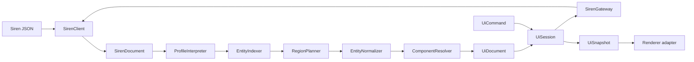

# Siren UI Runtime Architecture

Status: approved implementation design
Package: `@modwire/siren-ui`

## Engine

The runtime has two separate hearts:

1. `UiProjector` is a pure deterministic pipeline. It interprets profile discovery,
   indexes the Siren entity, plans regions, constructs the semantic graph, resolves
   component evidence, and freezes the result.
2. `UiSession` is a transactional driver. It accepts immutable commands, owns drafts
   and operations, calls a Siren gateway, applies loading and result strategies, and
   publishes immutable snapshots.

## Boundaries

- `domain`: immutable graph, state, diagnostics, component evidence;
- `projection`: pure normalization pipeline and node factories;
- `policy`: component specifications, predicates, loading and result strategies;
- `runtime`: commands, operation coordination, drafts and snapshots;
- `ports`: gateway, scheduler and observer contracts;
- `adapters`: Siren client and platform implementations;
- `public`: composition root and stable facade.

Dependencies point inward. Rendering frameworks consume snapshots and emit commands;
they never interpret profile metadata or execute affordances independently.

## Code contract

- classes and interfaces only;
- one primary abstraction per file;
- filenames do not repeat their folder name;
- no nullable or optional domain/application state;
- absence is represented by polymorphic objects;
- complete immutable values cross every internal boundary;
- the original `SirenDocument` remains reachable and unchanged;
- registration and promise completion order never decide semantics;
- only advertised Siren relations and actions can cause I/O.

## Patterns

| Pattern                   | Realization                                             |
| ------------------------- | ------------------------------------------------------- |
| Facade / Composition Root | `SirenUiEngine`                                         |
| Pipeline                  | interpreter → indexer → planner → normalizer → resolver |
| Composite / Visitor       | immutable UI node graph                                 |
| Specification             | component and predicate matching                        |
| Strategy                  | relation loading and action results                     |
| Command                   | renderer-to-session intents                             |
| State                     | action and relation operation objects                   |
| Ports and Adapters        | gateway, scheduler, client adapter                      |
| Null Object               | generic profile, absent predicate, empty exchange       |
| Snapshot                  | immutable session observation                           |

## Deterministic projection

Projection orders regions by `(order, id)`, properties by `(order, name)`, relations
by `(order, relation)`, actions by `(order, name)`, and fields by `(order, name)`.
Unassigned content goes to a deterministic `other` region. Canonical self-link cycles
become reference nodes.

Component resolution uses fixed specificity bands: domain class and role, named
relation/action and semantics, profile semantics, node fallback, unsupported fallback.
Equal-band equal-priority ambiguity emits a diagnostic and selects the generic fallback.

## Runtime

Commands identify semantic nodes, never URLs. A session publishes pending state before
I/O, accepts only the current operation result, applies a strategy, reprojects, then
publishes a committed snapshot with focus and announcement intentions. Closing a
session invalidates all outstanding work.

## Safety

The Siren client remains authoritative for parsing, origin policy, request encoding,
response validation and remote problems. Predicates affect presentation only.
Component references come only from the local registry. Sensitive values never enter
diagnostics. Automatic loading and monitoring are bounded.
